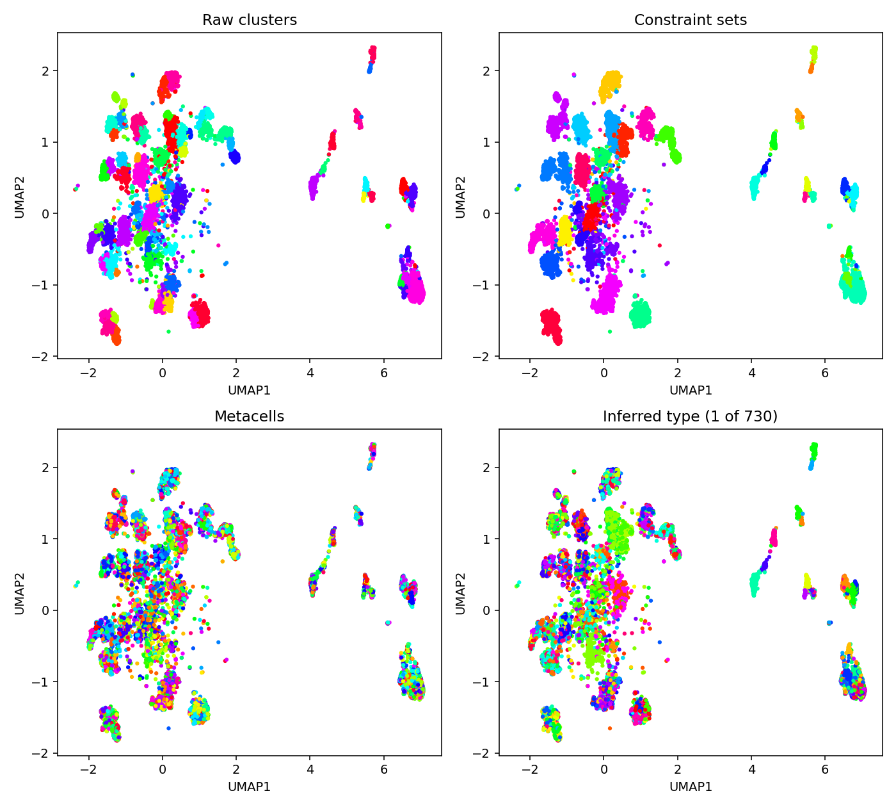
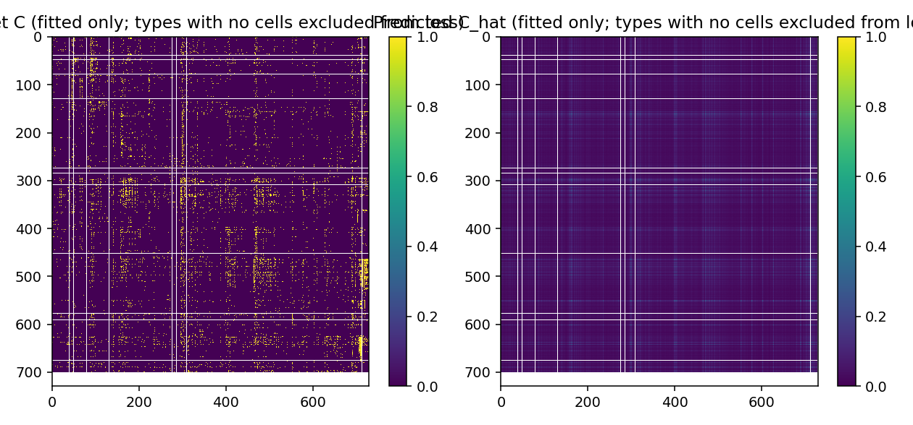
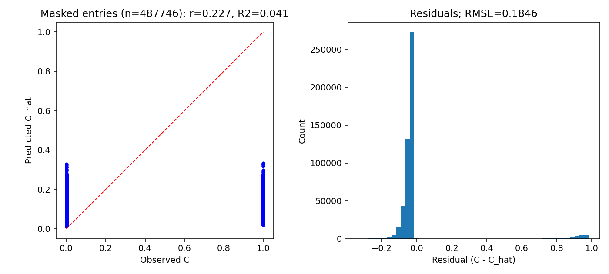
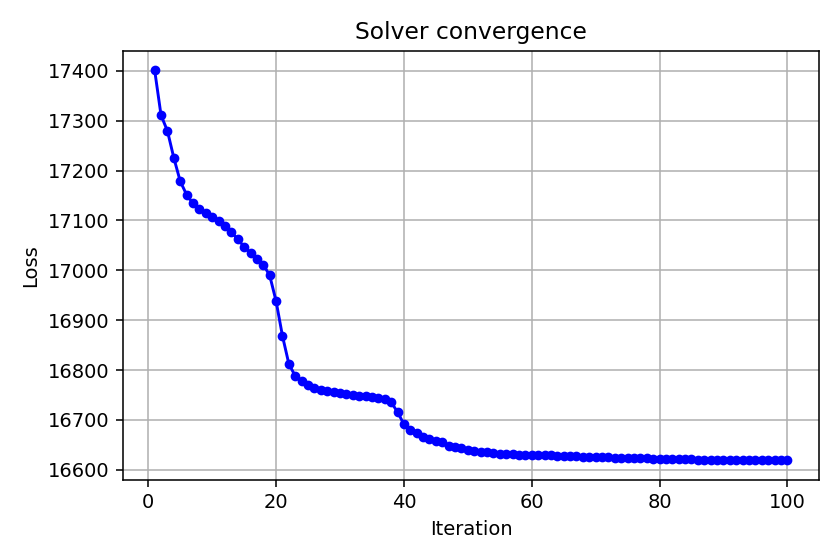
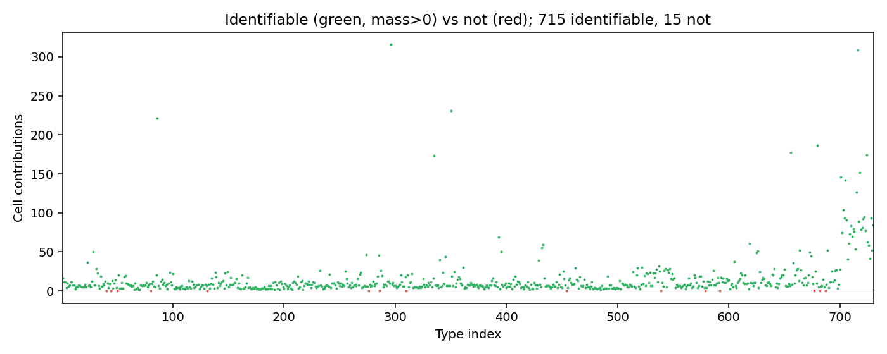
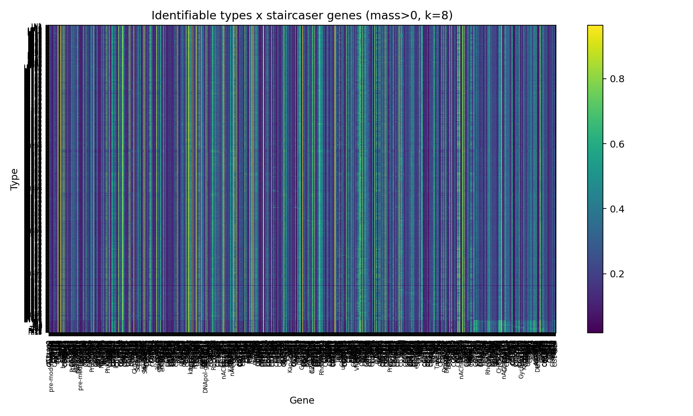

# ConnectionMiner

**Connectome-constrained deconvolution of neuronal cell types from single-cell RNA-seq**

ConnectionMiner jointly infers neuronal type identities and synaptic gene interaction programs from single-cell transcriptomics data, using the measured synaptic connectome as a structural constraint. It is applied here to the motor system of *Drosophila melanogaster*, resolving ~730 premotor and motor neuron types from thousands of single-cell measurements.

---

## Overview

A core challenge in single-cell genomics of the nervous system is that many cells in a dataset are replicates of the same neuron type — but type identity is not directly observed. ConnectionMiner addresses this by formulating type assignment and gene interaction inference as a joint optimization problem:

- **P** — a soft assignment matrix mapping cells (via metacells) to neuron types, inferred via entropic optimal transport
- **β** — a gene–gene interaction weight matrix encoding which gene pairs predict synaptic connectivity, inferred via multiplicative non-negative regression

Both are optimized alternately, each step using the other as a fixed constraint, until convergence. The connectome (which neuron types are synaptically connected) serves as the supervisory signal throughout.

### Pipeline

```
Raw scRNA-seq                 Connectome
(preMN + MN cells)            (type × type)
        │                          │
        ▼                          ▼
  ┌─────────────────────────────────────────┐
  │  1. Load                                │
  │     align genes · build constraints     │
  └─────────────────────┬───────────────────┘
                        │
                        ▼
  ┌─────────────────────────────────────────┐
  │  2. Preprocess                          │
  │     select HVGs · build metacells       │
  │     (PCA + K-means per constraint sig)  │
  └─────────────────────┬───────────────────┘
                        │
                        ▼
  ┌─────────────────────────────────────────┐
  │  3. Solve  (alternating optimisation)   │
  │     P  ← entropic OT (Sinkhorn)         │
  │     β  ← multiplicative regression      │
  └─────────────────────┬───────────────────┘
                        │
                        ▼
  ┌─────────────────────────────────────────┐
  │  4. Postprocess                         │
  │     type × gene probabilities           │
  │     identifiability assessment          │
  └─────────────────────┬───────────────────┘
                        │
                        ▼
  ┌─────────────────────────────────────────┐
  │  5. Export + Visualize                  │
  │     Excel tables · diagnostic figures   │
  └─────────────────────────────────────────┘
```

---

## Example Outputs

### Cell embedding and type assignment

UMAP of preMN cells coloured by (top-left) raw sequencing cluster, (top-right) constraint set membership, (bottom-left) metacell assignment, and (bottom-right) the top inferred type from the solver across 730 types.



---

### Connectome structure (input)

The 730 × 730 observed connectome **C** (left) and its solver-predicted reconstruction **Ĉ** (right). Rows/columns are neuron types; yellow = connected.



---

### Connectome fit (output)

Scatter of observed vs. predicted connectivity values across ~488 k measured type pairs, with residual distribution. Each point is a type-pair entry in **C**.



---

### Solver convergence

Total objective loss over 100 alternating iterations of P and β updates.



---

### Type identifiability

Cell contribution mass per inferred type. Green = identifiable (mass > 0); red = not identifiable. In a full run, 715 of 730 types are resolved.



---

### Inferred type × gene expression

Heatmap of inferred gene expression probabilities for all identifiable types across the top highly variable genes. Each row is a neuron type; each column is a gene.



---

## Repository Structure

```
connectionMiner/
├── cm_minimal/               # Python pipeline package
│   ├── run.py                # Entry point (CLI)
│   ├── config.py             # Default configuration
│   ├── paths.py              # Data path resolution
│   ├── models.py             # Data containers (RawData, PrepData, CmResult)
│   ├── loaders.py            # Load expression + connectome, align cells
│   ├── preprocess.py         # HVG selection + metacell construction
│   ├── solver.py             # Alternating P / β optimisation
│   ├── postprocess.py        # Type–gene probabilities + identifiability
│   ├── exports.py            # Excel export (type-gene table, synapse table)
│   ├── viz.py                # Diagnostic visualisations
│   ├── validate.py           # Shape/value invariant checks
│   ├── utils.py              # Shared helpers
│   ├── runs/                 # Output directory (timestamped, gitignored)
│   └── experiments/          # Exploratory scripts
├── matlab/                   # Archived MATLAB implementation
├── docs/
│   └── images/               # Example figures for this README
├── requirements.txt
└── README.md
```

---

## Installation

**Python ≥ 3.9** required.

```bash
git clone https://github.com/<your-org>/connectionMiner.git
cd connectionMiner
pip install -r requirements.txt
```

No additional R or MATLAB dependencies are needed for the Python pipeline.

---

## Data

Input data is **not included** in this repository (files are large). The pipeline expects the following layout under a `data_root` directory:

```
data_root/
├── scRNAseq PreMNs/
│   ├── counts_cg_corrected.txt          # preMN expression matrix (genes × cells)
│   ├── Cell_Cluster.xlsx                # preMN cluster → type mapping
│   └── umapCoord_vnc.csv                # preMN UMAP coordinates
├── Matrix and umap raw files/Merged/
│   ├── matched_gene_expression_cg_corrected.txt   # MN expression matrix
│   ├── matched_clusters.xlsx                      # MN cluster metadata
│   └── matched_umap_coordinates_time_specific.xlsx
├── Matrix and umap raw files/
│   └── MNs_detailed_info_matrix_*.xlsx  # MN detailed info
├── scRNAseq PreMNs/
│   └── PreMNs-MNs connection_*.xlsx     # Connectome table (preMN ↔ MN)
└── Genes list/
    └── Interactome_v3.xlsx              # Known ligand–receptor gene pairs
```

By default, `data_root` is resolved from `cm_minimal/paths.py`. To point to a different location, edit `paths.py` or pass overrides via `merge_config()`.

---

## Running

All commands are run from the **repo root**.

### Full run (binary expression mode)

```bash
python3 -m cm_minimal.run --mode binary
```

### Full run (Poisson-Gamma continuous mode)

```bash
python3 -m cm_minimal.run --mode pg --pg-run-dir <path-to-pg-output>
```

### Quick smoke test (subsampled, ~1 min)

```bash
python3 -m cm_minimal.run --mode binary --smoke --max-cells 500 --max-genes 500 --num-iter 2
```

### Unit tests

```bash
python3 -m cm_minimal.test_binary_smoke
python3 -m cm_minimal.test_export_one_iter
```

---

## Outputs

Each run writes to `cm_minimal/runs/run_YYYYMMDD_HHMMSS/`:

| File | Description |
|---|---|
| `prep.mat` / `prep_pg.mat` | Preprocessed metacell structures |
| `cm.mat` / `cm_pg.mat` | Solver result: P, β, objectives, reconstructed C |
| `run_manifest.json` | Run configuration and summary statistics |
| `solver_objectives.txt` | Loss per iteration (tab-separated) |
| `type_gene_probabilities.xlsx` | Inferred gene expression per type (all genes) |
| `synaptic_interaction_table.xlsx` | Gene pairs scored per synapse with effect sizes |
| `viz/` | Diagnostic PNG figures (see examples above) |

### `type_gene_probabilities.xlsx`

One row per neuron type. Columns:

| Column | Description |
|---|---|
| `type_name` | Neuron type identifier |
| `n_cells` | Cells assigned to this type |
| `cell_contributions` | Weighted cell contribution score |
| `identifiable` | Whether the type has non-zero mass |
| `{gene}_prob` | Inferred expression probability for each gene |

### `synaptic_interaction_table.xlsx`

One row per (synapse, gene pair) combination. Columns include synapse name, pre/post type identifiers, lineage, motor pool, interaction name, expression levels, interaction score, effect size, and p-value. Pruned to the top/bottom scoring entries per synapse.

---

## Configuration

Default parameters are in `cm_minimal/config.py`. Key settings:

| Parameter | Default | Description |
|---|---|---|
| `seed` | `750` | Global random seed |
| `binary.n_genes_use` | `4000` | Number of highly variable genes for solver |
| `metacell.target_size` | `10` | Target cells per metacell |
| `solver.num_iter` | `100` | Alternating optimisation iterations |
| `solver.lambda_sparsity` | `0.001` | L1 sparsity penalty on β |
| `solver.optimal_transport_epsilon` | `1e-12` | Entropic OT regularisation strength |
| `solver.use_binary_connectome` | `True` | Binarise C before fitting |

Override any parameter by passing a nested dict to `merge_config()` in your own script:

```python
from cm_minimal.config import default_config, merge_config

cfg = merge_config(default_config("binary"), {
    "solver": {"num_iter": 200, "lambda_sparsity": 0.01},
})
```

---

## Method Summary

**Metacell construction.** Cells are first grouped by their *constraint signature* — the unique pattern of neuron types they could plausibly belong to. Within each group, PCA + K-means produces compact metacells (target size 10 cells). This reduces compute while preserving biological structure.

**Joint optimisation.** The solver alternates between:

1. **β update** — given the current type assignment P, find gene–gene interaction weights β that minimise weighted connectome reconstruction error plus an L1 sparsity term. Solved via multiplicative updates that preserve non-negativity.

2. **P update** — given the current β, find soft type assignments P that minimise connectome reconstruction error plus an entropic regularisation term (encouraging uncertainty over plausible types). Solved via a Sinkhorn-style two-pass update with backtracking line search.

**Synaptic interaction scoring.** For each synapse and each candidate ligand–receptor gene pair, an effect size is computed by comparing gene-product co-expression between synaptically connected vs. non-synaptically connected type pairs (t-test). This identifies which molecular programs are enriched at specific synaptic connections.

---

## Citation

If you use ConnectionMiner in your research, please cite:

> *manuscript in preparation*

---

## License

*To be added.*
